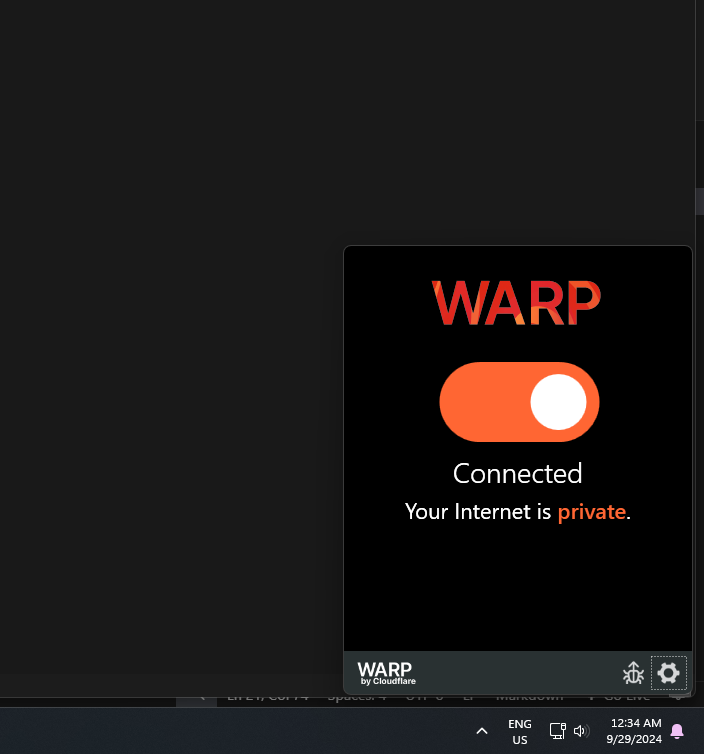

############## IMP NOTICE ######

Get Software from "https://one.one.one.one" and install it to not face any network provider issue while making API calls

# To Start Server Locally:-

 "npm run start"

#To Start a Production Build:-

"npm run  build"
 

# Flix GPT 

-Create React App => npx create-react-app {folder}
-TailWind CSS install and configured for create-reacct-app
-Header
-Routing
-Login Form
-Sign Up Form
-Form Validation
-useRef hook
-Firebase Setup 
-Deploying our app to production
-Create Signup Auth in Firebase
-Implement SignIn User API
-Create Redux Store for userSlice
-Implemented Signout using Firebase API
-Dispatch a new action while SignUp to fetch the updated values from auth
-Bug Fix of SignUp User, display name
-Bug Fix if the user is not logged in redirect "/browse" to "/" or vice versa
-Unsubscribed to the onAuthStateChanged Callback function
-Register for TMDB API and get Access Token
-Get Data from TMDB Now Playing Movie List 
-Custom hook for Now Playing Movies
-Planning for MainContainer and secondary container
-Fetch Data for Trailer Video
-Update Store with Trailer Video Data
-Embedded the Youtube and make it autoplay and mute
-Tailwind classes to make MainContainer look awesome

# Features
-Login/Signup Page
    - Sign In/ Singup Form
    -redirect to Browse Page

-Browse Page(Comes After Authentication)
    - Header
    -Main movie
        - Trailer in Background
        - Movie title and description
        -Movie Suggestions
            - MovieLists * n (Vertically scrollable)

-Flix Gpt 
    - Search Bar
    - Movie Suggestions
    
